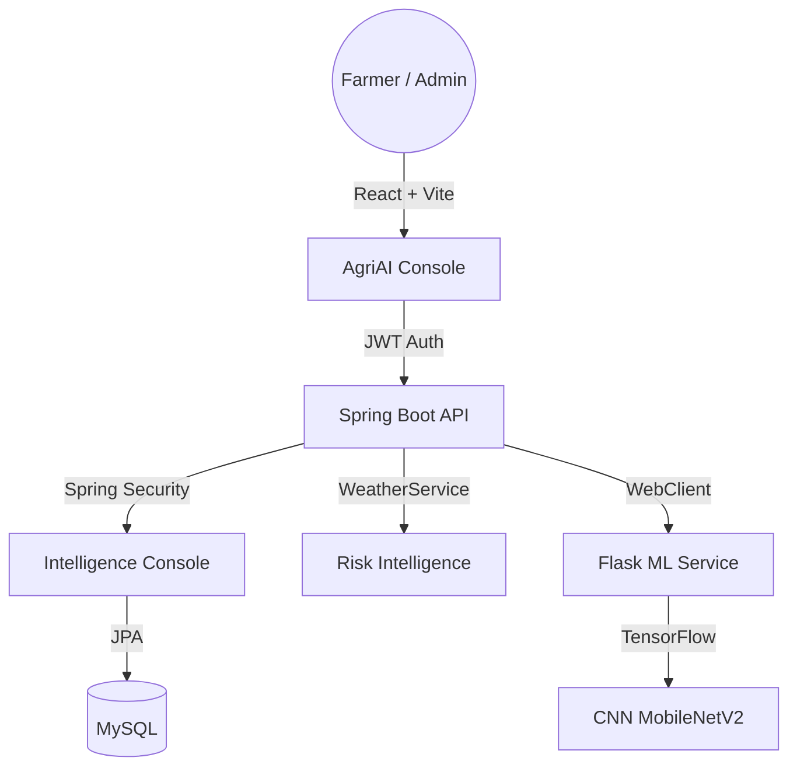

# 🌱 AI-Driven Crop Disease Prediction and Management System

## 📌 Overview

This project is an AI-powered crop disease prediction system built using:

- 🧠 CNN (MobileNetV2 – Transfer Learning)
- 🐍 Flask (ML Microservice)
- ☕ Spring Boot (Backend API)
- 🤖 AI Assistant (Floating Chatbot with FAQ Context)
- 🌡️ Weather Risk Intelligence (Real-time Disease Forecasting)
- 🌎 Multi-Language Support (English, Hindi, Tamil)
- 🛡️ Admin Intelligence Console (Secured Knowledge Base Management)
- ⚛️ React 18+ (Vite) / Spring Boot 3+ / Flask 3+
- 🗄️ MySQL (Relational Diagnostic Storage)

---

## 🏗️ System Architecture




---

## 🧠 Machine Learning Model

- Architecture: MobileNetV2 (Pretrained CNN)
- Technique: Transfer Learning
- Dataset: PlantVillage (15 Classes)
- Accuracy: ~93% Validation Accuracy
- Model Format: `.keras`

### Supported Crops:
- Tomato
- Potato
- Pepper (Bell)

---

## 🚀 How to Run the Project

---

### 🔹 1️⃣ Run Flask ML Service

# windows
```bash
cd flask-ml-service
python -m venv venv
venv\Scripts\activate   # Windows
pip install -r requirements.txt
python app.py

# Mac
cd flask-ml-service
python3 -m venv venv
source venv/bin/activate
pip install -r requirements.txt
python app.py

Runs on:

http://localhost:5000

🔹 2️⃣ Run Spring Boot Backend

cd backend
mvn spring-boot:run

Runs on:

http://localhost:8080

🔹 3️⃣ Run Frontend (React)

cd frontend
npm install
npm run dev

Runs on:

http://localhost:5173


📂 Project Structure
AI-Driven_Crop-Disease-Prediction/
│
├── crop-disease-frontend/
├── crop-disease-backend/
└── flask-ml-service/